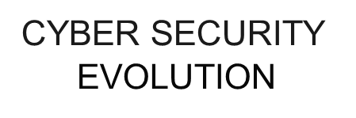
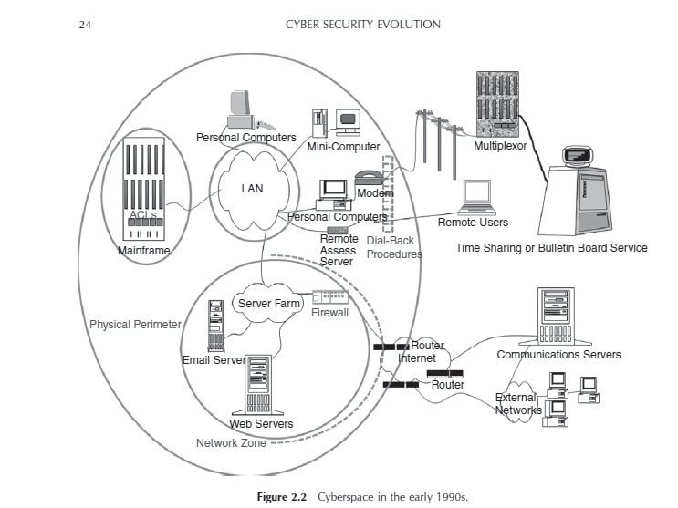
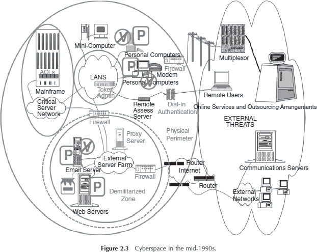

# Notes for Unit 1 - INTRODUCTION

## What is Cyber Security?

Cyber security generally refers to the ability to control access to networked systems and the information they contain.

Where cyber security controls are effective is known as cyberspace and is **considered a reliable, resilient, and trustworthy digital Infrastructure.**

Where cyber security controls are absent, Incomplete, or poorly designed, **cyberspace is considered the wild west of the digital age.**

Whether a system is a physical facility or a collection of cyberspace components, the role of a security professional assigned to that system is to plan for potential attack and prepare for its consequences.

- **The goals of cybersecurity-** _prevent, detect, respond_
- **The means to achieve cyber security-** _people, process, technology_
- **The mechanisms by which cyber security goals are achieved:** _confidentiality, Integrity, and availability._
- _Prevent, detect, respond_ addresses goals common to both physical and cyber security.
- _People, process, technology_ addresses methods common to both technology management In general and to cyber security management as a specialized field.
- _Confidentiality, integrity, and availability_ addresses the security objective that are specific to Information.
- Confidentiality refers to data, objects and resources are protected from unauthorized viewing and other access.
- Integrity refers to data is protected from unauthorized changes to ensure that it is reliable and correct. .
- Availability refers to that authorized users have access to the systems and the resources they need.

## What Is Cyber Security Policy?

The tension between demand for cyber functionality and requirements for security is addressed through cyber security policy.

The word "policy" has been used to refer to laws and regulations concerning information distribution, private enterprise objectives for information protection, computer operations methods for controlling technology, and configuration variables in electronic devices (Gallaher, Link et al. 2008).

## Cyber Security Policy

## Cyber Security Policy perspectives

In Figure 1.2, the links to and from the "governance bodies" node illustrate that cyber security policy is adopted by governing bodies as a method of achieving security goals. The figure is purposely generic as governing bodies often exist outside of the organizations that they govern.

## Domains of Cyber Security Policy

Where security is a priority for an organization, it iscommon to see cyber security policies Issued by multiple Internal departments with overlapping constituencies, who then sometimes detect policy incompatibility issues in trying to follow them all simultaneously.

### Laws and Regulations

Nation-state cyber security policy Is currently considered to be a subset of national security policy. Even if nation-state cyber security policy was considered to be on the same plane as foreign policy or economic policy, these policies do not have the same force as law.

Policies are established and articulated through report and speeches, through talking points and negotiations

Policies is used to guide Judgement on what laws and regulations to consider.

It does not refer to the laws and regulation's themselves..

Enterprise Policy

Private sector organizations are generally not _as_ constrained as governments in turning senior management policies Into actionable rules. In a corporate environment, It Is typical that polices are expected to be followed upon threat of sanction to and Including employment termination.

Technology Operations

In an effort to assist clients in complying with legal and regulatory information security requirements, the legal accounting, and consulting profession’s have adopted standard. for due diligence with respect to Information security, and recommended that clients model processes around them. These were sometimes proprietary to the consulting firm, but were often based on published standards such as the National Institute of Standards and Technology (NIST)

_Recommended Security Controls for Federal_ _lnformation_ _Systems_ and their private sector counter-parts.

-Technology Configuration

Because many technology operations standards are implemented using specialized security software and devices, technology operators often colloquially refer to the standard-specified technical configuration or these devices as "security policy“. These specifications have _over_ the years been implemented by vendors and service providers, who devised technical configurations of computing devices that would allow system administrators to claim compliance with various standards.

## Strategy versus Policy

Cyber security policy articulates the strategy for cyber security goal achievement and provides its constituents with direction for the appropriate use of cyber security measures.

Without a clear conceptual view of cyber security Influences, It would be difficult to devise cyber security strategy and corresponding policy.

Key to cyber security policy formulation ls:

to recognize that security control decisions are made regardless of whether there is a formal policy in place,

to understand that Policy is the appropriate tool to guide multiple independently made security decisions, and

to absorb as much Information as possible about how security decisions are Influenced In the course or devising security strategy.

## Cyber security management cycle

Individual policy statements are usually debated in the course of cyber security strategy development, and they are an outcome of it.

When fully articulated, policy statements are used to facilitate awareness of cyber security strategy to individuals responsible for its execution. The awareness program is done for policy compliance and to motivate the implementation of policy-compliant systems.

policy compliance is monitored. Monitoring may be continuous via automated sensors, periodic checks and balances, and/or it may be intermittent, as in a lifecycle review process. Where such monitoring identifies issues with policy compliance, or cyber security incidents that are not anticipated by policy, remediation plans are considered.

Where no remediation plan is considered feasible, this feedback is consumed by cyber security strategists, who use it to refine policy .

Process got automated with goal to increase in Productivity that replaced human calculators with automated programs producing more accurate results.

IntroductionoftheInternetfurther enabled productivity by allowing quick and accurate communication of information.

Online Transactions came into action.

e- Commerce took the market.

By 2000, the economy had become so dependent one-commerce that it was a frequent target of cyber criminals, and securitytechnologyevolvedtoprotectdatathatcouldbeusedtocommitfraudulenttransactions.

## Productivity

Evolution started in 1960s with the mainframe.

the first type of computer that was affordable enough for businesses to see a return on investment from electronic data processing systems.

Computers were secured with guards and gates.

Physical security procedures were devised to ensure that only people authorized to work on computers had physical access to them.

Large systems to work with.

By the late 1960s, remote job entry allowed punched cards to be received from multiple office locations connected via cables to the main computer.

Computers security staff responsible for tracing this cables under raised floors,and though wall spaces to check the authorized person at work

Accuteaware of security risk

Confidentiality, integrity and availability triad was not yet industry standard.

Apart from military and intelligence, confidentiality was not the major security requirement

Catastrophic data integrity error from hum entries.

Software engineering organizations were the first to raise the security alarm because computers were starting to control systems where faulty operations could put lives at Risk.

**In 1970s,**

punched cards were replaced by electronic input andoutputviakeyboardsandterminals

Cables extended for internet working

Securitypersonnelswere not safe guarding

Screens were limited by business logic coded into the software.

For example, a supervisor observing the customer service clerkcouldenteraspecialcodetoallowaone-timebalancechangeoperationthroughtheotherwiselimitedscreenfunctionality.

Concepts of cryptography was introduced.

Data units encrypted using private keys and decrypted back to original message at destination

In recognition of growing confidentiality requirements, but without any good way to meet them, the US National bureau of standards (now the national Institute of Standards and Technology [ N IST]) launched an effort to achieve consensus on a national encryption standard.

In 1974, the U .S Computer Security Act (Privacy Act) was the first stake in the ground designed to establish control over information propagation.

Later the word processing software were implemented for work automation

Timesharing system where introduced where clients were charged for system use

Companies began to specialized by industry, developing complicated software such as payroll tax calculation and commercial lease calculations

User identification through user name and password

From 1970 to 1980, minicomputers became attract human for personal use.

In late 1970, Apple introduced home computers.

In 1981 , IBM introduced Personal Computer (PC).

The local area network (LAN) cables were protected much like the computer terminals' connection to the mainframe.

A newtype of network equipment called a hub allowed the communication, and hubs had to be kept in a secure area.

Mandatory access controls (MAC) allowed management to label Computer objects (programs and files) and specify the subjects (users) who could access them.

Discretionary schemes (DAC) that allowed each user to specify who could access their files.

Timesharing-type password technology was employed on LAN. LAN user names were primarily supported to facilitate directory services rather than to prevent determined attack.

Cyberspace presented a new avenue of inquiry for law enforcement investigating traditional crimes.

Criminals were caught boasting of their crimes on the social networking sites of the day, which were electronic bulletin board services reached by modems over phone lines.

Law enforcement partnered with technology vendors to produce software that would recover files that crimi - nals had attempted to delete from computers.

Cyberspace in the 1980s.

D irectory services were available that allowed businesses to connect, and be connected to, the research and military restricted advanced research projects agency (ARPA) network, or _ARPANET_ , whose use case and name were relaxed as it evolved into the public _Internet_ .

Technology-savvy companies quickly registered their domain names so that they could own their own corner of cyberspace.

R esearchers were concerned with the potential for system abuse due to the exponential expansion of the numbers of connected computers.

**Robert** **Morris** **at** **AT&T** **Bell** **Laboratories.**

**early computer pioneer:**

In 1988, Robert Tappan Morris devised the first Internet worm.

The “Morris Worm” accessed computers used as email servers, exploited vulnerabilities to identify all the computers that were known to each email server, and then contacted all of those computers and attempted the same exploits.

Internet communication virtually stopped with few hours, computing resources were so overwhelmed by the worm’s activities that they had no processing cycles or network bandwidth left for transaction processing, leaving business processes disrupted.

But APARNET was saved they have installed FIREWALL(A method of inspecting each individual information packet within a stream of network traffic).

The firewall was designed to allow network access to only those packets whose _source_ and _destination_ matched those on a previously authorized list.

Network addresses and port number used for communication.

The Bell Labs firewall was hastily employed to safeguard AT&T’s email servers, and the impact to AT&T from the Morris worm was minimal.

The primary cyber security implementation strategy of choice since then has been to deploy firewalls.

Computer Emergency Response Team (CERT) to provide technical assistance to those who suffered from cyber security problems.

Same type of vulnarabilities like Morris worm in Internet-facing email servers exists in systems that presented modem interface to the public.

Most Hacker interested for stealing some system time to play games without information to vulnerable users system.

Hackers who steal time to play are Joyriders.

By 1992, few hackers have profit motives.

In 1986, Cliff Stoll, noticed a billing error in the range of 75 cents of computer time that was not associated with any of hisusers .

Stoll ended up tracking the missing cents of computing time to an Eastern European espionage ring.

published detective Article called _The Cuckoo’s Egg_. (lock the system via modems)

no firewall-like technology for phones.

caller Id and dial-back.

Caller id checks the authorization of caller from database.

Dial-back calls back the caller on checking the validity of called number.

Safe at Dial-back modems, it became easy to surf in home network and other region.

## Cyberspace in the early 1990s.

The devices represent the logical location of the firewalls and telecommunication line connections to other firms.

The telecommunication lines are portrayed as logically segmented spaces where lines to business partners terminate on the internal network. private lines

all these network periphery controls did not prevent the hackers and joyriders from disrupting computer operations with viruses .

viruses were distributed on floppy disks and also planted on websites for advertisement to corporate and government Internet users.

**Actions on Virus:**

D igital signature were created for each virus by identifying each file it altered and the types of logs it left behind.

Anti-virus software were created and Digital Signatures of each virus were recorded.

Software security flaws and Bugs were detected by Cyber Forensics.

As the signature that identified one virus was not tied to the software flaw but to the files deposited by the virus itself, a virus writer could slightly modify his or her code to take advantage of the same software vulnerability and evade detection by antivirus software.

Updation of Anti-virus Software.

Locally the software bugs were repaired known as PATCHES.

Its origin in the context of computers referred to a cable plugged into a wall of vacuum tubes that altered the course of electronic processing in an analog computer by physically changing the path of code execution.

Patches are small files that must frequently be installed on complex soft- ware in order to prevent an adversary from exploiting vulnerable code and thereby causing damage to systems or information.

vulnerabilities in software became the source of what was then called “the port 80 problem”.

Port 80 is the port on a firewall that has to be open in order for external users to access web services.

Starting from port 80 on a server facing the Internet, a web server program was designed to accept user commands instructing it to display content, but it would also allow commands instructing it to accept and execute programs provided by a user.

The immediate result of the port 80 problem analysis was that firewalls were installed not just at the network periphery but in a virtual circle around any machine that faced the Internet.

A Demilitarized Zone (DMZ) network architecture became the new security standard. (Bell Labs)

A DMZ was an area of the network that allowed Internet access to a well-defined set of specific services.

In a DMZ, all computer operating software accessible from the Internet was “hardened” to ensure that no other services could be accessed from those explicitly allowed, or that were considered “sacrificial” systems that were purposely not well secured, but closely monitored to see if attackers were targeting the enter- prise (Ramachandran 2002).

C yber D MZ is surrounded by checkpoints on all sides.

The design of a D MZ requires that Internet traffic be filtered so packets can only access the servers that have been purposely deployed for public use,

The design of a D MZ requires that Internet traffic be filtered so packets can only access the servers that have been purposely deployed for public use, and are fortified against expected attacks.

It became standard procedure that the path to the internal network was opened only with the express approval of a security architect, who was responsible for testing the security controls on all D MZ and internally accessible software.

The huge growth of e-commerce was envied by the competing sites. sites attempted to stop the flow of e-commerce to competitors by intentionally consuming all the available bandwidth allowed through the competitor firewall to the competitor websites.

Because these attacks prevented other Internet users from using the web services of the stricken competitor, they were designated “denial of service” attacks.

distributed denial of service” or “ DDoS .”

**Security** **researchers**

Passwords

Handheld devices

Bio-metric identification,

Credit card-sized handheld devices capable of generating tokens

The term “blacklist” became to be known in computer security literature as the list of websites that were known to propagate malicious software (“malware”).

A list of the universal resource locations ( U RLs) corresponding to Internet sites called a “ blacklist.”were made as first use of technology.

A web proxy server blocks a user from accessing sites on the blacklist.

The proxy is enforced because browser traffic is not allowed outbound through the network periphery by the firewalls unless it comes from the _proxy_ _server_ , so users have to traverse the proxy service in order to browse.

The immense growth of releasing the various forms of malicious attack, it became hetic to keep on updating the existing mechanism.(Enterprise security management)

Firewalls were placed on the Internal side of the telecommunications lines that privately connected firms from their third party service providers.

only expected services were allowed through, and only to the internal users or servers that required the connectivity to operate.

**VP**

Mini-Computer

Personal Computers

LANS

Token Admin

Personal **V** Computers

Mainframe

Critical Server Network

Remote Users

Online Services and Outsourcing Arrangements

Assess Authentication

EXTERNAL THREATS

Physical Perimeter

Communications Servers

Demilitarized Zone

External Networks

## Cyberspace in the mid-1990s.

The vs with the lines through them indicate that antivirus software was installed on the types of machines identified underneath them.

The Ps stand for patches that were, and still are, frequently required on the associated computers.

The shade of gray used to identify security technology is the same throughout the diagram. The dashed line encircles the equipment that is typically found in a dMZ .

## E-commerce

e-Commerce established connection between market and customer in device.

The first such sites were fraught with risk of fraud and threats to confidentiality because of the number of telecommunications devices that suddenly gained unfettered access to customer information, including credit card numbers.

In 1995, a new encrypted communications protocol called Secure Socket Layer (SSL).

In 1999, the protocol was enhanced by committee and codified under the name Trans- port Layer Security (TLS **)**

The TLS protocol requires web servers to have long identification strings, called certificates.

The software allowed them to create a _root_ certificate for their company, and the root certification was used to generate server certificates for each company web server.

For critical applications that facilitated high asset value transactions, certificates could also be generated for each customer, which the SSL protocol referred to as a _client_ .

The SSL protocol thus made use of certificates to identify client to server and server to client.

once mutually identified, both sides would use data from the certificates to generate a single new key they both would use for encrypted communication.

This allows each web session to look different from the point of view of an observer on the network, even if the same information, such as the same credentials, are transmitted.

_Identity_ _management systems_ were developed to ease the administration and integrate customer login information and online activity with existing customer relationship management processes.

Security strategies were devised to control and monitor code development, testing, and production environments.

Source code control and change detection systems became standard cyber security equipment.

Remote access still required two-factor authentication, and this was judged an adequate way to maintain access control, particularly when combined with other safeguards, such as a control that prevents a user from being able to have two simultaneous sessions.

To maintain confidentiality of customer information, the entire remote access session would have to be encrypted. _Virtual Private Network_ (VPN) technology

Innovative security companies sought to relieve workstations from their virus-checking duties by providing network-level _intrusion_ _detection_ _systems_ (IDSs).

The idea behind IDS was the same as that behind signature-based antivirus technology,

Technical configurations such as firewall rule sets, security patch specifica - tions , wireless encryption settings, and password complexity rules were colloquially referred to as “security policy.”

_Security_ _policy_ _servers_ were established to keep track of which configuration variables were supposed to be on which device.

If a device failed or was misconfigured, it would take too much work to recreate the policies.

Security policy servers economically and effectively allowed the technology configurations to be centrally monitored and managed .

Inspire of many security policies and strategy, cybercrimes was reported.

_security_ _information_ _management_ (SIM) servers, which were designed to store and query massive numbers of activity logs.

A SIM server validate the activity logs and compliances the policy.

## Cyberspace in the early 2000s.

e-Commerce security has motivated to gear-up the security levels to next level.

The patch management processes had been enhanced to add _tripwires_ to detect and report software changes.

Tripwire use physical security as triggering mechanism that detects change in environment.

These internal software change detection mechanisms were also called host intrusion detection systems ( HIdSs ).

Main aim of HIDS is to recognize and segregate against insider and external threats.

The area were divided into networked zones.

Each zones has its critical process in isolation.

## Countermeasures

Technology could not stop the success rate of cyber attack.

New attack came into force like:

Malware: malicious software/ sites

_phishing_ and _pharming_ _:_ redirecting to malicious addresses as look-alike sites.

Spyware : send user names and passwords to criminal data collection websites

And many more………

The concern of the cyber security Expert was to focus on prevention of all such cybercrimes.

The countermeasures were dictated for the prevention of Cyber Attacks.

Data thefts through laptops, stolen devices.

Remote user backup there data on USB devices.

Some steps were taken to destroy all data on the devices through software and programming technologies in case of device theft.

Vendors hastly provided methods to encrypt laptop disks and USB devices.

Companies adopted standards and procedures for the authorized use of digital media, and restricted access to the devices.

Many devices were being encrypted, it became difficult for administrators to keep up with procedures to safeguard encryption keys.

Simple key management systems such as password-protected key databases were used in1990s,but later landed in trouble of huge generation of keys.

Security vendors stepped in with automated key storage and retrieval systems.

keys are stored on special hardware chips physically protected in isolated locations and accessible only by the equipment used to control access to the devices.

This created trouble in decryption when required at different locations.

Not such security is designed for E mails server since Morris warm Attack.

No proper agreements are used for encryption on both ends.

Attempts are made to identify authorized emails servers via Certificates like keys.

Email security vendors created software to assist in the analysis of email content, and many companies who suspected that confidential data such as PII was being sent via email for work-at-home purposes thereby found that many of their business processes routinely emailed such data to customer or service providers.

Internal users ignore security policy.

content filtering adopted.

Patterns were created for identifying sensitive information.

generalized social security numbers and tax identification numbers from other countries.

snippets in internally developed company software.

All information sent by users to the Internet, or other publicly accessible networks, is routed through a device that either blocks the information from leaving or silently alerts security staff, who investigate the internal user.

Hackers still found there way to infect the network.

The network control of the dMZ does not prevent a web software developer from deploying code that can be used to imitate any network activity that is allowed by the web server itself.

developers innovate by sharing the software source code via both public (“open source”) and proprietary development projects.

Reusing the codes for more functionality.

Use free software (“freeware”) for which no source code is available.

Like the lists of viruses and software vulnerabilities, software security mistakes have been cataloged as part of the national vulnerability database project (MITRE 2009; MITRE ongoing).

Cyber security vendors have created security source code analy - sis software to be incorporated into source code control systems so these bugs can be found before software is deployed.

Static software analysis, which reads code as written.

Dynamic software analysis, which reads code as it is being executed.

_web access firewalls_ (WAFWs), are programmed to detect unsecure software as it is used, and block attempts to exploit it in real time.

Content filters prevent users from sending sensitive information to the Internet.

Intrusion prevention devices have replaced intrusion detection devices.

## Cyberspace and cyber security countermeasures

### Cyber crime attack paths

#### CHALLENGES

- Cyber security policy is concerned with stakeholders in cyberspace .
- The number and type of cyberspace stakeholders far exceeds the scope envisioned with the first Computer Security Act.
- Threats are detected, no optimum counter measures.

#### Major Challenges of 2018

- Ransomware Evolution.
- Al Expansion.
- Serverless Web Vulnerabilities.
- IoT Threats.
- Block Chain Evolution.
